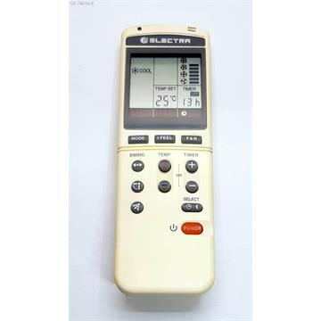
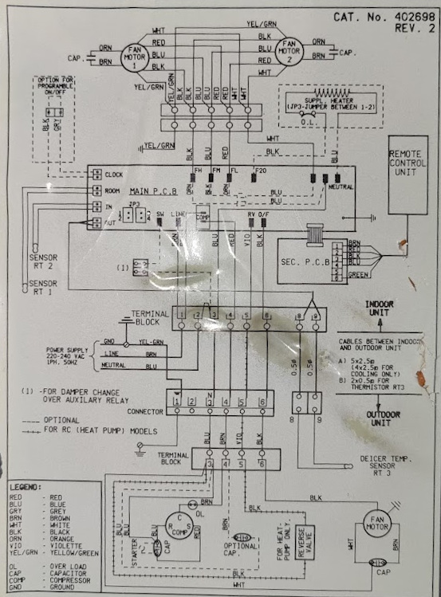
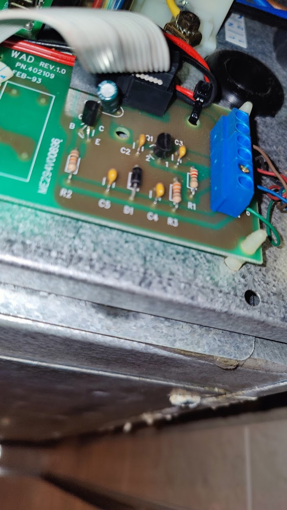
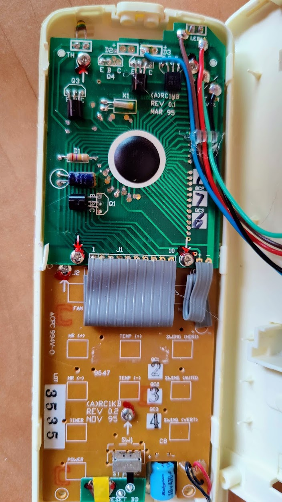
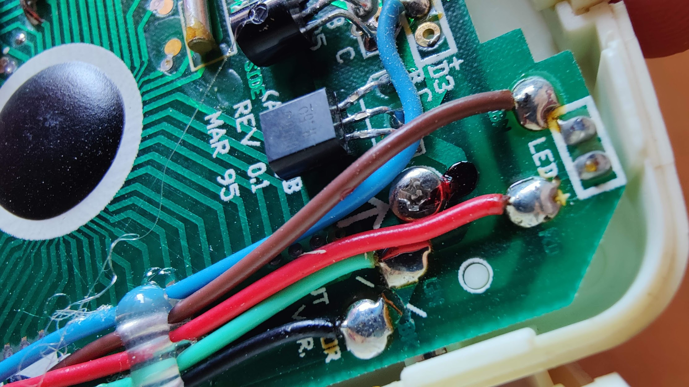
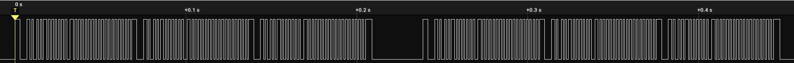
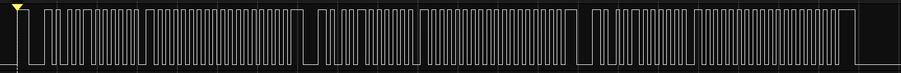
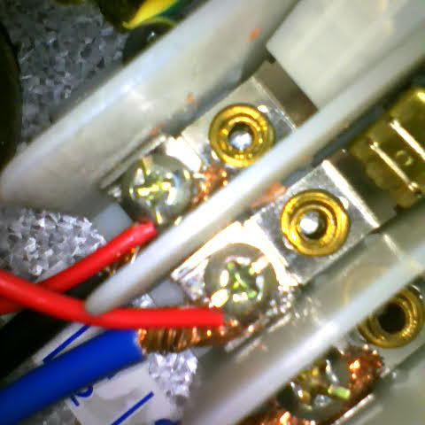
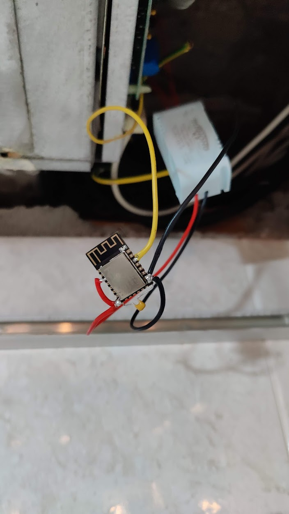
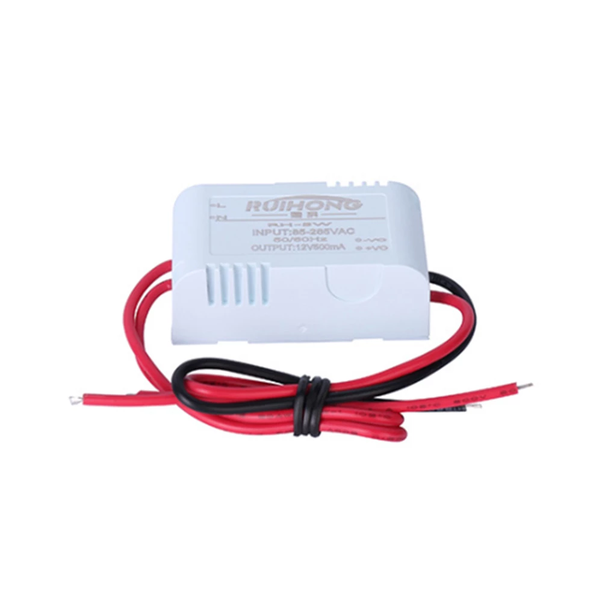

# Do this at your own risk and only if you know what you're doing, I'm not responsible for any damages that could happen. It worked for me but in your case voltages could be different or even the wiring.

# White-WestingHouse (Electra/Electrolux) Climate

This is my implementation to transform my wired AC to a smart AC. The AC has a single wired RC controlled that communicated with a single line to the AC, so this implementation mimics the RC controller to be able to be controlled using [ESPHome](https://esphome.io/).

## AC Parts

The AC has a Remote controller (Part no. 435620)


Main board (Cat. No. 402698) diagram for WC-28 B condenser


The communication controller in the main board (ME294V00896 - WAD Rev 1.0)


# Research

## Wiring
I opened the RC/W controller to try to figure out what is each communication cable.



With this, we now that the brown and blue cables are being used to power the led in the RC. The black cable should be a GND and it is. So we have two remaining wires, blue and green. After checking the voltages we get that the blue is always at high level (5V) while the green is always at a low level (0V). Furtheremore if you disconnects the blue wire, and powers the RC with an alternative 5V supply the RC works, so it is the power supply for the RC (It has two AAA batteries too). With this the only wire that could send the data is the green one.

In summary

| Wire Color | Purpose |
|------------|---------|
| Red        | LED +   |
| Brown      | LED -   |
| Black      | GND -   |
| Blue       | 5V  +   |
| Green      | Data    |

## Data

To inspect the signal send from the RC to the communication interface, I've got the logic analyzer AZDelivery Logic Analyzer with 8 channels.


With this I plugged the Green wire and GND to the logic analyzer and got several signals with the different RC options. [There is a capture with time markers explaining each signal part in this repository](./custom_components/electrolux_climate/protocol/18%20degrees%20-%20annotated.sal) that you can open with the [salaee program](https://www.saleae.com). You have all the captures taht I used in the [protocol folder](./custom_components/electrolux_climate/protocol/).

The data is send twice with a delay in between them

and each frame constains the same data three times.


So we are going to analyze the differences between the different captures. Each captura has only one change, so the change in the signal is obvious. After checking a few captures we get that:

* The frequency is 512Khz
* Every data has a 6 bits header (111000)
* The three repeated data block finish with 8 bits (11110000)
* We see in the temperature that each bit is encoded in two bits for the communication. Bit 0/low is translated to bits "10" and 1/high is translated to "01"

### Structure
With this rules we get that the data payload contains (ignoring header) has 32 bits.

The payload follows the next structure:

| Letter | Meaning                                                                |
|--------|------------------------------------------------------------------------|
| S      | Indicates if turn on/off or do nothing                                 |
| M      | AC Mode (Auto, Cool, Heat, Fan or Dry)                                 |
| F      | Fan speed (Low, Medium, High or Auto)                                  |
| I      | I feel system (enable/disable)                                         |
| T      | Temperature                                                            | 
| ?      | Unknown bits or reserved. Probably related with non migrated features. |

SMMMFFF??ITTTT??????????????????

Take into account that it is the payload structure before the encoding (Check last point on Data main section)

With this we just need to know the values for each feature that can be easily detected checking the different frames.

#### Turn on/off

| Feature       | Bit mask |
|---------------|----------|
| Switch ON/OFF | 1        |
| Do Nothing    | 0        |


#### AC Modes

| Feature       | Bit mask |
|---------------|----------|
| Cool          |      001 |
| Heat          |      010 |
| Auto          |      011 |
| Dry           |      100 |
| Fan           |      101 |

#### I feel system

| Feature  | Bit mask |
|----------|----------|
| Enabled  |        1 |
| Disabled |        0 |


# Temparature

The temperature goes from 16 to 30 and is send from 1 to 16, so we just need to substract 15 to the number and get the bit representation.
It is important to represent it with 4 bits.

| Feature  | Bit mask |
|----------|----------|
| 16       |     0001 |
| 17       |     0010 |
| 18       |     0011 |
| 19       |     0100 |
| 20       |     0101 |
| 21       |     0110 |
| 22       |     0111 |
| 23       |     1000 |
| 24       |     1001 |
| 25       |     1010 |
| 26       |     1011 |
| 27       |     1100 |
| 28       |     1101 |
| 29       |     1110 |
| 30       |     1111 |

# Implementation

To implement the new RC I'm using ESPHome to easily integrate with [Home Assistant](https://www.home-assistant.io/) and use the current supported devices and different libraries. Thankfully exists a Climate IR implementation that allows you to configure the protocol and the bits that you want to send and the library do all the job, so In this component you are just going to see how to transform the request into a valid payload for the AC main board.

# How to install it

**IMPORTANT** I was not able to maintain the original RC. If the data bus from the microcontroller is connected to the main board data bus, the original controller stops working. If somebody know how to fix it, open an issue, thanks.

I installed the microcontroller directly in the mainboard. The microcontroller is a ESP12f and it is placed in the mainboard to be able to connect a converter (240V AC to 3.3V DC) because the power received for the original RC was not enough to supply the microcontroller.

Power supply connection (240V AC)


Data and GND connection


ESP12f final connections


240V AC to 3.3V DC converter (It can be found in Aliexpress)



# Notes

This is not a fully RC implementation. I didn't tried to know how to configure some options like for example the swing because I don't have it, but it can be discovered easily using the method I explained in the Research part. 

Another thing is that I didn't used the led signal to know if the LED is on or off and this is because the the LED is off, the voltage is 17V so I cannot connect that to the ESP8266.

There is no OFF AC mode in the RC, so I invented one that is controlled by ESP8266, so if it is set to off, it turns off the AC but if the AC mode is different it turns ON the AC.

Finally you can use ESP32 or ESP8266 in your setup. I used ESP32 for developing nad finally using a ESP8266 in the final solution because it is smaller and the first approach was to encapsulate it inside the RC.a


# How to burn your firmware

## Configuring
You need to create a configuration yaml like for example with the component configuration:
```
# Configuration example:
external_components:
  - source: github://joskfg/white-westinghouse-ac-controller

remote_transmitter:
  pin: GPIO5
  carrier_duty_percent: 100%

climate:
  - platform: electrolux_climate
    name: "aire acondicionado"
```
You can see a full example in [airconditioner.yaml](airconditioner.yaml)

## Burning
You can use docker or ESPHome to burn the firmware.

Docker example:
```
docker run --rm -v "${PWD}":/config -it --network=host esphome/esphome run airconditioner.yaml
```